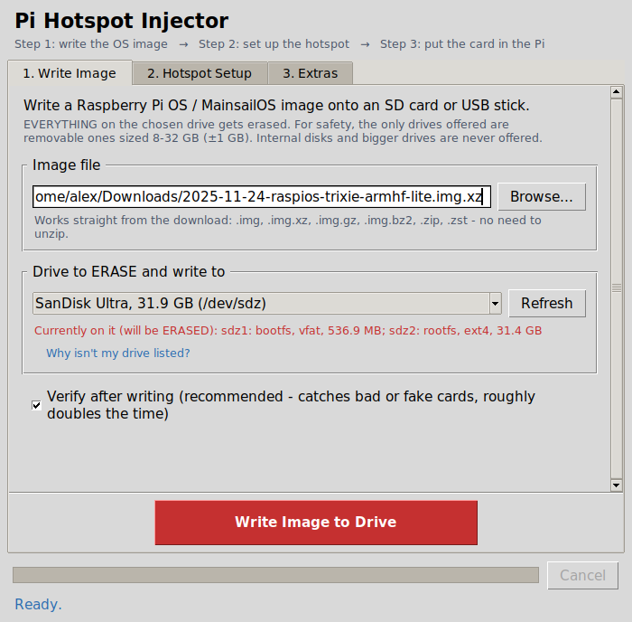
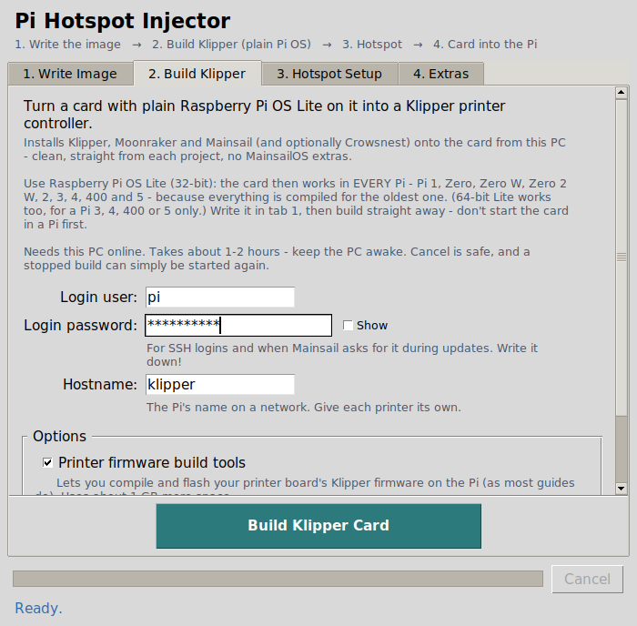
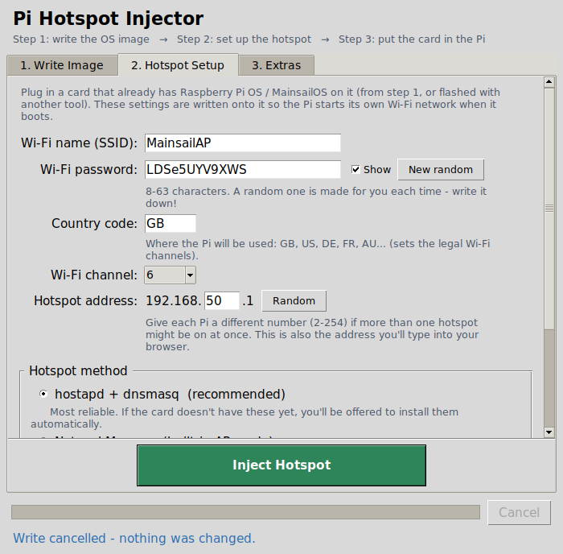
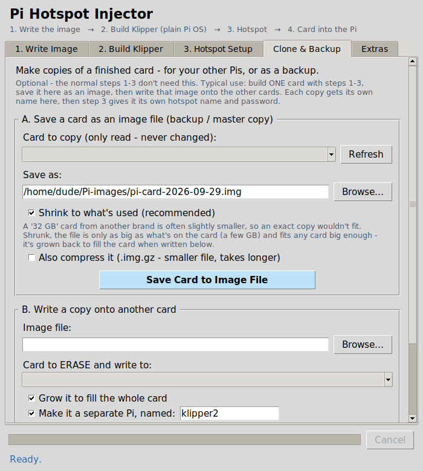
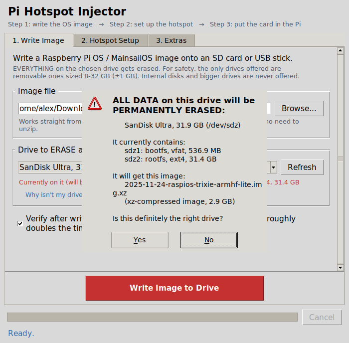
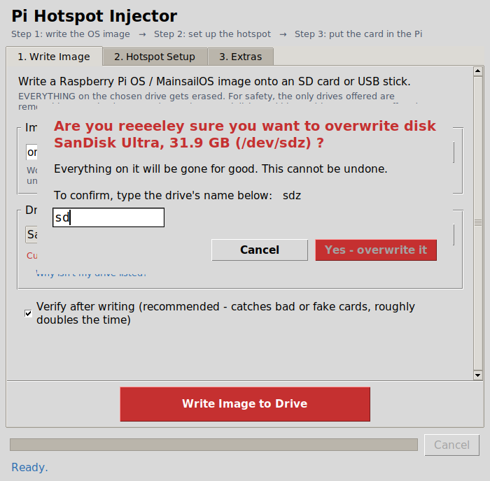
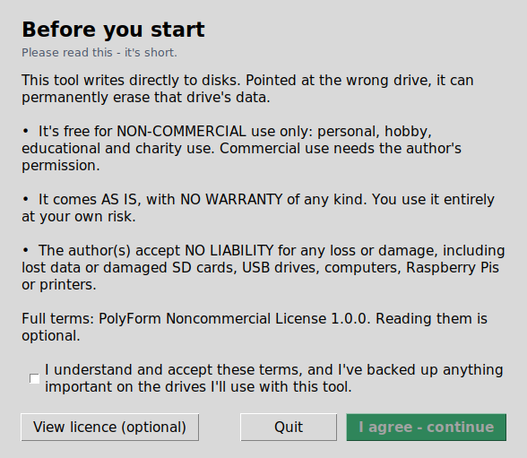

# Pi Hotspot Injector


**Source-available · Non-commercial** · Linux desktop · Pi 1 to Pi 5 · [Project page](https://The-Dorkknight.github.io/pi-hotspot-injector/)


> **Licence:** free for **non-commercial** use (personal, hobby, educational, charity). Provided **as is, with no warranty and no liability**. See [LICENSE.md](LICENSE.md) (PolyForm Noncommercial 1.0.0). Use it at your own risk: it can erase the wrong drive if you pick the wrong one.

A point-and-click Linux tool that turns a blank SD card into a **Klipper 3D-printer controller that broadcasts its own Wi-Fi hotspot**. It's handy in a workshop or garage with no Wi-Fi network around: power the Pi on, join its Wi-Fi from your phone or laptop, and open Mainsail in a browser.

**One card works in every Raspberry Pi**, from the original Pi 1 and Pi Zero W up to the Pi 4, 400 and 5.

It does everything from your Linux PC, with no need to boot the Pi first or plug in a keyboard and screen:

1. **Write the OS image** (Raspberry Pi OS Lite, or MainsailOS) to an SD card or USB stick, straight from the downloaded `.img.xz` / `.zip`.
2. **Build Klipper**: install Klipper, Moonraker and Mainsail (plus Crowsnest if you want a webcam) onto a clean Raspberry Pi OS Lite card. Everything comes clean and straight from each project, compiled so it runs on every Pi.
3. **Set up the hotspot**: Wi-Fi name, password, country and IP address.
4. **Clone & Backup** (optional): save a finished card as an image file, and copy it onto more cards, each one becoming a separate Pi with its own name.
5. **Extras**: a Pi Zero / Pi 1 compatibility check-and-fix for existing cards, the **Card Inquisitor** boot diagnostics, and a standalone hostapd + dnsmasq installer.


| Write the image | Build Klipper |
|---|---|
|  |  |
| **Set up the hotspot** | **Clone & Backup** |
|  |  |
| **Sanity check 1 of 2** | **Sanity check 2 of 2** |
|  |  |

---

## ⚠️ Read this first

This tool writes directly to disks. Used on the wrong drive, it **permanently erases** that drive's data. It has several safety guards (below), but **back up anything important** before you use it, and double-check which drive you pick.

<!-- Photos of the real thing: add docs/images/unit.jpg, unit-2.jpg and real-feed.jpg, then remove these comment markers.
## In real life

| | | |
|---|---|---|
|  |  |  |
-->

## More documentation

- [HOW_IT_WORKS.md](HOW_IT_WORKS.md): what the tool does to your card and PC, step by step
- [CHANGELOG.md](CHANGELOG.md): what changed in each version
- [THIRD_PARTY.md](THIRD_PARTY.md): the software it installs, and their licences
- [Project page](https://The-Dorkknight.github.io/pi-hotspot-injector/) (GitHub Pages)
- [CONTRIBUTING.md](CONTRIBUTING.md) and [SECURITY.md](SECURITY.md): reporting problems

## Requirements

- A Linux desktop PC: Ubuntu, Linux Mint, Debian, Pop!_OS, KDE neon, Fedora, etc.
- Python 3.6 or newer (already installed on all of the above).
- Tkinter, the Python GUI library. It's missing on some Ubuntu/Mint installs:
  ```bash
  sudo apt install python3-tk        # Ubuntu / Mint / Debian
  sudo dnf install python3-tkinter   # Fedora
  ```
- `pkexec` for the password prompt. It's already present on virtually every desktop install.
- Optional: `zstd` only if you want to write `.zst` images directly. On apt-based distros (Ubuntu, Mint, Debian) the tool installs `qemu-user-static` itself the first time you use the package installer.

## Install

```bash
git clone https://github.com/The-Dorkknight/pi-hotspot-injector.git
cd pi-hotspot-injector
chmod +x pi_injector.py PiInjector.desktop
```

(Or download the ZIP from GitHub and extract it anywhere. **Keep `pi_injector.py` and `PiInjector.desktop` in the same folder.**)

## Start it

**Double-click `PiInjector.desktop`.** The first time, your file manager may ask whether you trust it. That's a one-off security check you have to click through:

| Desktop | What to do |
|---|---|
| Linux Mint (Cinnamon / Nemo) | Click *Mark as Trusted* (or *Launch Anyway*) |
| KDE (Dolphin) | Click *Continue* / *Execute* if asked |
| Ubuntu (GNOME Files) | GNOME Files won't run launchers from ordinary folders. Start it once from a terminal (below), then use **Extras → Add to applications menu** |

Then enter your password when asked. The tool needs administrator rights to write to SD cards, and it asks for them itself.

**Or**, from a terminal: `python3 pi_injector.py`

Once it's running, **Extras → Add to applications menu** puts it in your start menu like any other app.

On startup, a short disclaimer appears that you must accept before you can use the tool. Reading the full licence from that screen is optional.



## How to use it

### 1. Write Image
1. Press **Download Raspberry Pi OS Lite (32-bit)**. It fetches the official image (about 530 MB) from raspberrypi.com, checks it against their published checksum, and fills it in for you. Flaky Wi-Fi is fine: progress is saved as it goes (a checkpoint every 10 MB, plus wherever the connection drops), and it reconnects by itself and carries on from there. Cancel just pauses it; press Download again later, even after a restart, to continue. (Downloading it yourself is fine too: it's the `…-raspios-…-armhf-lite.img.xz` file. **Not** "Raspberry Pi Desktop for PC and Mac", which is a PC ISO that can't run on a Pi.) MainsailOS works too; then skip step 2.
2. Plug in your SD card (in a USB reader) or USB stick.
3. **Browse...** to the image, pick the drive, then **Write Image to Drive**.
4. Get past the **two sanity checks** (below). Writing and verifying take a few minutes.

### 2. Build Klipper
1. Leave the freshly written card plugged in. **Don't boot it in a Pi first**, because the build needs a never-started card.
2. Choose a login user (default `pi`), a password (**write it down**) and a hostname (give each printer its own).
3. Options: **Printer firmware build tools** (on by default; lets you compile and flash your printer board's firmware on the Pi, as most guides do; uses about 1 GB) and **Crowsnest** (webcam support).
4. **Build Klipper Card**. It takes about 1–2 hours and needs this PC online, so keep the PC awake. What it does:
   - enlarges the card's system partition (as the Pi would on its first start);
   - sets up the user, SSH and hostname;
   - installs Klipper, Moonraker, Mainsail, nginx and (optionally) Crowsnest, straight from each project;
   - on a 32-bit card, compiles everything for the oldest Pi and checks every compiled file;
   - finally **test-starts Moonraker** on an emulated Pi to prove it works.
5. Cancel is safe. A stopped or failed build can simply be started again, and it carries on where it left off.

After the first start, Mainsail will show a Klipper error until you put your printer's configuration into `printer.cfg`. Klipper's example configs are in `~/klipper/config/`.

### 3. Hotspot Setup
1. Leave the card plugged in (or insert a card flashed with another tool).
2. Check the settings. A random Wi-Fi password is generated for you: **write it down**. Set the country code to where the Pi will be used.
3. **Inject Hotspot**. If the card lacks hostapd/dnsmasq, the tool offers to install them (this PC needs internet access; it takes 5–15 min).
4. Note the Wi-Fi name, password and web address it shows you.

### 4. Use it
Put the card in the Pi and power it on. **The first boot takes a few minutes** because the Pi sets itself up and may restart once. Then join the Wi-Fi network and open `http://192.168.50.1` (or whatever address you chose). On a laptop, `http://<hostname>.local` works too (e.g. `http://klipper.local`; the hostname is the one set in step 2, not the login user name). Phones often can't open `.local` names, so use the number there.

If your phone has joined a hotspot with the same name before, choose **Forget network** on it first. Otherwise it may quietly try the old saved password.

Running more than one of these hotspots at once? Give each card a different **Hotspot address** number (or press *Random*), so they don't clash.

## Clone & Backup (several Pis)

Setting up several Pis? Build **one** card with steps 1–3, then:

1. **A. Save a card as an image file**: pick the finished card; it is only read, never changed. With **Shrink** ticked (recommended) the file is only as big as what's on the card, a few GB, so it fits any card big enough. That matters because a "32 GB" card from another brand is often slightly smaller than yours. Optionally compress it to `.img.gz`.
2. **B. Write a copy onto another card**: pick the image and a blank card (the same two safety checks as tab 1). The copy is grown to fill the card and, with **Make it a separate Pi** ticked, gets its own name (`klipper2`, `klipper3`…), a fresh machine ID and new SSH keys, so two Pis never get mixed up on a network.
3. Run **step 3** on the copy to give it its own hotspot name and password.

Keep the image file as a backup: if a card ever dies, write it again in a few minutes. To restore onto the *same* Pi, untick **Make it a separate Pi**.

## Which Pi?

A card built from **Raspberry Pi OS Lite (32-bit)** runs in any of these:

| Pi | Works | Notes |
|---|---|---|
| Pi 1 A/B, Zero, Zero W | ✅ | Everything is compiled for these (ARMv6). Slow, but fine for one printer. |
| Zero 2 W, Pi 2, Pi 3 | ✅ | |
| Pi 4, Pi 400 | ✅ | Best choice for printing plus a webcam. |
| Pi 5 | ✅ | Runs the 32-bit card fine. For a Pi 3, 4 or 5 only, the 64-bit Lite image also works. |

The build emulates the Pi Zero's own processor while it compiles, so nothing ends up built for a newer chip than the oldest Pi's. Every newer Pi runs that code natively. That's also why cards built with this tool don't hit the Moonraker *Illegal instruction* crash that affects some ready-made images on a Pi Zero.

## Safety features

- **Size window:** only removable drives sold as **8–32 GB** (±1 GB tolerance) are ever offered as write targets. External hard drives, SSDs, 64 GB+ sticks and tiny drives are refused outright.
- **Internal disks are never offered:** SATA/NVMe drives, built-in eMMC storage, the live-USB stick you booted from, and anything holding this PC's system, home folders or swap are excluded.
- **Two sanity checks before erasing:**
  1. A summary of the drive, what's on it now (partition names), and the image that will replace it. **No** is the default button.
  2. *"Are you reeeeley sure you want to overwrite disk …?"* You must **type the drive's name** (e.g. `sdb`) to enable the button.
- **Re-checks the drive right before writing.** If it was unplugged or swapped for another one with the same name, nothing is written.
- Refuses to write an image file that's **stored on the drive being overwritten**.
- The hotspot, diagnostics and package tools only touch a card that really is a Raspberry Pi OS card (checked read-only first).
- **Build Klipper** checks read-only first that it's a never-started Raspberry Pi OS card, that the user name doesn't clash with a system account, and that the filesystem checks clean with this PC's tools. Only then does it change anything. It never touches a card that's already been used.
- Checks that the image **fits**, and warns if the file doesn't look like a bootable disk image.
- **Exclusive access:** the kernel blocks the write if anything still has the drive open.
- **Verify after writing** (on by default) reads the drive back and compares checksums. This catches faulty and fake-capacity cards.
- Won't let you close the window mid-job without a warning. **Cancel** works during writes and package installs, and the card is tidied up (temporary mounts and files removed) even if the tool is closed or killed.
- **"Why isn't my drive listed?"** explains exactly why each drive was excluded.

The size window is set by `MIN_WRITE_TARGET_BYTES` / `MAX_WRITE_TARGET_BYTES` near the top of `pi_injector.py`. Change it at your own risk.

## Troubleshooting

| Problem | Fix |
|---|---|
| Nothing happens when I double-click | Make both files executable (`chmod +x`) and click *Trust / Allow Launching*. Or run `python3 pi_injector.py` in a terminal to see any error. |
| "Tkinter isn't installed" | `sudo apt install python3-tk` |
| Window doesn't open on a Wayland desktop | Run `xhost +SI:localuser:root` once in a terminal, then start the tool again. (It tries to do this automatically.) |
| My drive isn't listed | Click **Why isn't my drive listed?** Common reasons: outside the 8–32 GB range, write-protected (slide the SD adapter's lock switch), or no card in the reader. |
| "Write-protected" | Slide the little **LOCK** switch on the SD card or adapter towards the contacts. |
| Verification failed | The card is probably faulty or counterfeit, or the reader/cable is flaky. Try a different card and USB port. |
| Hotspot doesn't appear | Wait 3–5 minutes on the first boot. Still nothing? Use **Extras → Add diagnostics**, boot the Pi, then read `XXXXX_DIAGNOSTICS.txt` on the card's boot partition. |
| Package install fails with a "lock" error | This PC's automatic updates are running. Wait a few minutes and retry. |
| "No Raspberry Pi OS on the card" / "PC/Mac installer" | The card has a PC ISO (e.g. *Raspberry Pi Desktop for PC and Mac*) or nothing on it. Use **Download Raspberry Pi OS Lite (32-bit)** in tab 1 and write that. |
| `pi.local` doesn't work | `pi` is the login user; the web name is the **hostname** from step 2 (default `klipper` → `http://klipper.local`). Or use the number, e.g. `http://192.168.50.1`. |
| Joined the hotspot without being asked for the password | Your device probably remembered it from an earlier card with the same hotspot name. Choose **Forget network** and join again: it should ask. Give each Pi its own hotspot name. |
| "Download paused" | The connection kept dropping for a few minutes, or you pressed Cancel. Nothing is lost: press **Download** again and it resumes from where it stopped. |
| Build stopped with "lost its internet connection" | Downloads are retried automatically for about 3 minutes first. Fix the Wi-Fi/cable, then press **Build Klipper Card** again: it carries on where it stopped. |
| Build Klipper says the card "has already been started" | The build needs a never-booted card. Write Raspberry Pi OS Lite to it again (tab 1) and build straight away. |
| Build Klipper says this PC's "filesystem tools are too old" | Newer Raspberry Pi OS uses ext4 features older Linux versions don't know. Use Ubuntu 24.04 / Linux Mint 22 or newer. Nothing on the card was changed. |
| Moonraker keeps restarting on a **Pi Zero / Zero W / Pi 1**, log says `status=4/ILL` or *Illegal instruction* | The image contains software built for newer Pis. **Extras → Check card**, then **Fix for Pi Zero / Pi 1** (rebuilds it for these older Pis; needs internet, 30–90 min). Or use a Pi Zero 2 W, which runs the image as it is. |

A log is kept at `~/pi_injector.log` (passwords are never logged).

## Known limitations

- **Linux PCs only.** It needs Linux tools (`lsblk`, `chroot`, `resize2fs`…). It won't run on Windows or macOS.
- **Tested mostly on simulated cards.** The safety checks, writer, downloader, builder and Clone & Backup were tested with loop devices and a test Linux system, plus real-world runs on a Linux Mint laptop with a Pi Zero W card. Other PCs, card readers and Pi models haven't all been tried. Please report what you find.
- **Clone & Backup's "grow to fill the card" step** reuses the builder's partition-growing code but hasn't been tried on many real cards yet.
- **Slow on an old Pi.** The Pi Zero / Pi 1 is fine for one printer but slow; a Pi 3/4 is nicer if you want a webcam.
- **The build needs a fresh, never-booted card** and this PC online for 1–2 hours.
- **Drives are limited to 8–32 GB removable** on purpose, for safety.
- Some screenshots in `docs/images/` are from earlier versions.

## Compatibility notes

- Target images: Raspberry Pi OS / MainsailOS based on **Bookworm or newer** (NetworkManager-based).
- The **hostapd + dnsmasq** method is recommended. NetworkManager's own AP mode is unreliable on the Pi Zero W's BCM43430 Wi-Fi chip on trixie-based images.
- For cards not built with this tool, the optional login user from *Hotspot Setup* is created via `userconf.txt` on the boot partition. (A built card already has its user.)
- Built from Raspberry Pi OS **with desktop** instead of Lite? That works too. The card is set to start without the graphical desktop, to leave memory for Klipper (switch it back on with `sudo raspi-config` → System Options → Boot).
- A built card has cloud-init and Raspberry Pi OS's first-boot "create a user" wizard switched off. The build has already set up the user, SSH and hostname, and those first-boot tools would otherwise rename the user and break Klipper's paths.
- After you run updates *on the Pi itself*, pip picks packages for that Pi's own processor. If you later move such a card from a Pi 3/4/5 into a Pi Zero / Pi 1, run **Extras → Check card** first.
- **Pi Zero, Zero W and Pi 1 (ARMv6):** some recent images (e.g. MainsailOS 3.x, whose build moved to ARMv7) include compiled software these older boards can't run, so Moonraker crash-loops with *Illegal instruction*. *Hotspot Setup* warns you when it spots this, and **Extras → Fix for Pi Zero / Pi 1** rebuilds the affected Python packages from source for ARMv6, then tests each one on an emulated Pi Zero CPU. The Pi Zero 2 W, 3, 4 and 5 aren't affected.

## Licence

Copyright (c) 2026 Matthew Armstrong ([The-Dorkknight](https://github.com/The-Dorkknight)).

Licensed under the [PolyForm Noncommercial License 1.0.0](LICENSE.md). You may use, copy, modify and share this software for **any non-commercial purpose**. Commercial use requires separate permission from the author.

**THE SOFTWARE COMES AS IS, WITHOUT ANY WARRANTY OR CONDITION, AND THE LICENSOR WILL NOT BE LIABLE FOR ANY DAMAGES ARISING OUT OF ITS USE**, including lost data or damaged storage devices, computers, Raspberry Pis or printers. You use it entirely at your own risk.

Because commercial use is restricted, this is *source-available* software, not "open source" in the OSI sense. GitHub will show the licence as "Other". This is not legal advice.
